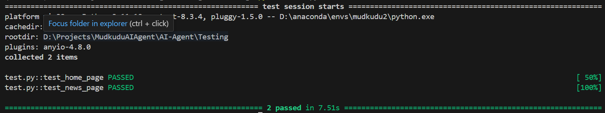

## Test Suite for `app.py`

This repository contains a test suite for the `app.py` file, which is responsible for handling web requests. The test suite includes unit tests to verify that the home and news pages of the app are functioning as expected.

### Comprehensive Test Suite

This test suite is designed to perform unit tests for the basic routes of the app, verifying that the home page and the news page return the expected status codes and content.

#### Unit Tests

- **Home Page Test:**
  - **Relevance of Responses:** Verifies that the home page (`/`) returns a successful response (`200 OK`) and contains the word "Mudkudu" in its content.

- **News Page Test:** Verifies that a POST request to the `/news` route with the company name "Google" in the form data returns a successful response (`200 OK`) and contains the phrase "Latest News".

### Integration Tests

Currently, the test suite only includes unit tests. However, if needed, additional integration tests can be added to verify the interaction between various components of the app.

# Installation and Setup

This guide will walk you through setting up and running the testing environment

## 1. Activate the Conda environmnet

``` bash
conda activate mudkudu_env
```

## 2. Install dependencies

``` bash
pip install pytest
```
## 2. Install dependencies

``` bash
pip install pytest
```

## 3. Go to Testing directory

``` cd Testing ``

## 4. Run the script

```bash
pytest test.py -v
```

## Expected Output
If all tests pass, you will see an output similar to this:

